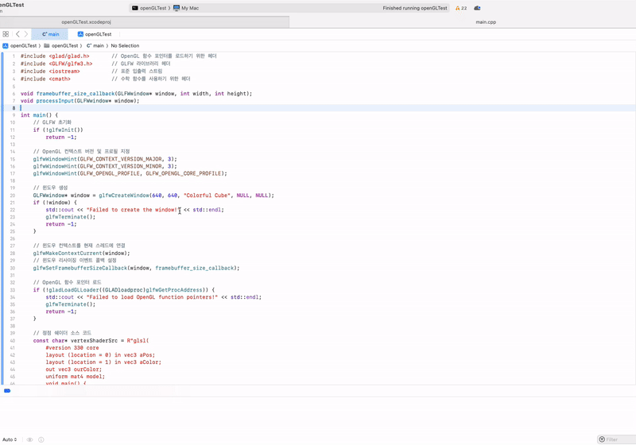
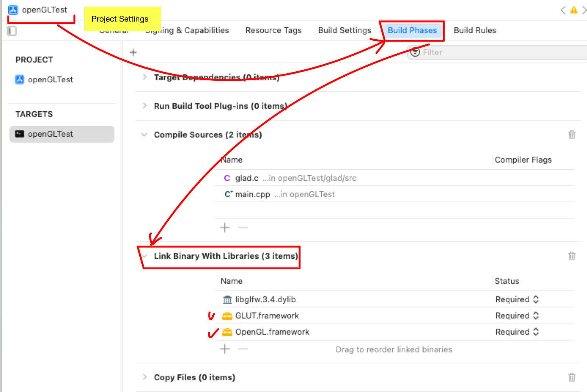

# OpenGL

> 💡 개발환경
> 
> 
> **OS :** MacOS Sonoma 14.4.1(23E224)
> 
> **Processor :** 3 GHz 6코어 Intel Core i5
> 
> **통합개발환경 :** Xcode Version 15.3 (15E204a)
> 


# 실행화면





# OpenGL 기본 설정 방법


1. 프로젝트 설정에 들어간다
2. Build Phases에서 Link Binary With Libraries에 Glut , OpenGl framework를 추가한다



# Building GLFW


1. GLFW 설치 (3.4버전을 설치함)
    
    ```bash
    brew install glfw
    ```
    
2. CMAKE 설치 (3.29.3버전을 설치함)
    
    ```bash
    brew install cmake
    ```
    

# 프로젝트 생성 및 세팅


1. **프로젝트 생성**
    
    
    
    
    
2. **프로젝트 설정**
    1. **glfw폴더 찾기**
        
        ```bash
        brew info glfw
        ```
        
        
        
        > /usr/local/Cellar/glfw/3.4 에 위치한것을 확인할 수 있다.
        > 
    2. **library 링크**
        
        
        
        
        
    3. 추가한 화면
        
        
        
    4. 헤더파일 사용을 위해 search paths 경로에 추가
        
        
        
    5. **GLAD설정**
        1. glad 홈페이지 접속, 아래와 같이 설정
            
            [https://glad.dav1d.de](https://glad.dav1d.de/) 
            
            
            
        2. zip파일 다운로드
            
            
            
        3. zip폴더 압축해제 후 프로젝트 폴더로 이동 
            
            
            
        4. 컴파일 소스목록에 glad.c 추가
            
            
            
        5. 헤더파일 사용을 위해 search paths 경로에 추가
        
        
        

# 코드


```cpp
#include <glad/glad.h>       // OpenGL 함수 포인터를 로드하기 위한 헤더
#include <GLFW/glfw3.h>      // GLFW 라이브러리 헤더
#include <iostream>          // 표준 입출력 스트림
#include <cmath>             // 수학 함수를 사용하기 위한 헤더

void framebuffer_size_callback(GLFWwindow* window, int width, int height);
void processInput(GLFWwindow* window);

int main() {
    // GLFW 초기화
    if (!glfwInit())
        return -1;

    // OpenGL 컨텍스트 버전 및 프로필 지정
    glfwWindowHint(GLFW_CONTEXT_VERSION_MAJOR, 3);
    glfwWindowHint(GLFW_CONTEXT_VERSION_MINOR, 3);
    glfwWindowHint(GLFW_OPENGL_PROFILE, GLFW_OPENGL_CORE_PROFILE);

    // 윈도우 생성
    GLFWwindow* window = glfwCreateWindow(640, 640, "Colorful Cube", NULL, NULL);
    if (!window) {
        std::cout << "Failed to create the window!" << std::endl;
        glfwTerminate();
        return -1;
    }

    // 윈도우 컨텍스트를 현재 스레드에 연결
    glfwMakeContextCurrent(window);
    // 윈도우 리사이징 이벤트 콜백 설정
    glfwSetFramebufferSizeCallback(window, framebuffer_size_callback);

    // OpenGL 함수 포인터 로드
    if (!gladLoadGLLoader((GLADloadproc)glfwGetProcAddress)) {
        std::cout << "Failed to load OpenGL function pointers!" << std::endl;
        glfwTerminate();
        return -1;
    }

    // 정점 쉐이더 소스 코드
    const char* vertexShaderSrc = R"glsl(
        #version 330 core
        layout (location = 0) in vec3 aPos;
        layout (location = 1) in vec3 aColor;
        out vec3 ourColor;
        uniform mat4 model;
        void main() {
            gl_Position = model * vec4(aPos, 1.0);
            ourColor = aColor;
        }
    )glsl";

    // 프래그먼트 쉐이더 소스 코드
    const char* fragmentShaderSrc = R"glsl(
        #version 330 core
        in vec3 ourColor;
        out vec4 FragColor;
        void main() {
            FragColor = vec4(ourColor, 1.0);
        }
    )glsl";

    // 정점 쉐이더 생성 및 컴파일
    unsigned int vertexShader = glCreateShader(GL_VERTEX_SHADER);
    glShaderSource(vertexShader, 1, &vertexShaderSrc, NULL);
    glCompileShader(vertexShader);

    // 정점 쉐이더 컴파일 상태 확인
    int success;
    char infoLog[512];
    glGetShaderiv(vertexShader, GL_COMPILE_STATUS, &success);
    if (!success) {
        glGetShaderInfoLog(vertexShader, 512, NULL, infoLog);
        std::cout << "Failed to compile vertex shader!\n" << infoLog << std::endl;
    }

    // 프래그먼트 쉐이더 생성 및 컴파일
    unsigned int fragmentShader = glCreateShader(GL_FRAGMENT_SHADER);
    glShaderSource(fragmentShader, 1, &fragmentShaderSrc, NULL);
    glCompileShader(fragmentShader);

    // 프래그먼트 쉐이더 컴파일 상태 확인
    glGetShaderiv(fragmentShader, GL_COMPILE_STATUS, &success);
    if (!success) {
        glGetShaderInfoLog(fragmentShader, 512, NULL, infoLog);
        std::cout << "Failed to compile fragment shader!\n" << infoLog << std::endl;
    }

    // 쉐이더 프로그램 생성, 링크
    unsigned int shaderProgram = glCreateProgram();
    glAttachShader(shaderProgram, vertexShader);
    glAttachShader(shaderProgram, fragmentShader);
    glLinkProgram(shaderProgram);

    // 쉐이더 프로그램 링크 상태 확인
    glGetProgramiv(shaderProgram, GL_LINK_STATUS, &success);
    if (!success) {
        glGetProgramInfoLog(shaderProgram, 512, NULL, infoLog);
        std::cout << "Failed to link shader program!\n" << infoLog << std::endl;
    }

    // 생성된 쉐이더 객체 삭제
    glDeleteShader(vertexShader);
    glDeleteShader(fragmentShader);

    // 큐브의 각 면의 정점과 색상을 정의
    float vertices[] = {
        // Positions          // Colors
        -0.5f, -0.5f, -0.5f,  1.0f, 1.0f, 1.0f,  // White
         0.5f, -0.5f, -0.5f,  1.0f, 1.0f, 1.0f,
        -0.5f,  0.5f, -0.5f,  1.0f, 1.0f, 1.0f,
         0.5f,  0.5f, -0.5f,  1.0f, 1.0f, 1.0f,

        -0.5f, -0.5f,  0.5f,  0.0f, 1.0f, 1.0f,  // Cyan
         0.5f, -0.5f,  0.5f,  0.0f, 1.0f, 1.0f,
        -0.5f,  0.5f,  0.5f,  0.0f, 1.0f, 1.0f,
         0.5f,  0.5f,  0.5f,  0.0f, 1.0f, 1.0f,

        -0.5f,  0.5f, -0.5f,  1.0f, 0.5f, 0.0f,  // Orange
         0.5f,  0.5f, -0.5f,  1.0f, 0.5f, 0.0f,
        -0.5f,  0.5f,  0.5f,  1.0f, 0.5f, 0.0f,
         0.5f,  0.5f,  0.5f,  1.0f, 0.5f, 0.0f,

        -0.5f, -0.5f, -0.5f,  1.0f, 0.0f, 0.0f,  // Red
         0.5f, -0.5f, -0.5f,  1.0f, 0.0f, 0.0f,
        -0.5f, -0.5f,  0.5f,  1.0f, 0.0f, 0.0f,
         0.5f, -0.5f,  0.5f,  1.0f, 0.0f, 0.0f,

        -0.5f, -0.5f, -0.5f,  0.5f, 0.5f, 0.5f,  // Gray
        -0.5f, -0.5f,  0.5f,  0.5f, 0.5f, 0.5f,
        -0.5f,  0.5f, -0.5f,  0.5f, 0.5f, 0.5f,
        -0.5f,  0.5f,  0.5f,  0.5f, 0.5f, 0.5f,

         0.5f, -0.5f, -0.5f,  0.0f, 0.0f, 1.0f,  // Blue
         0.5f, -0.5f,  0.5f,  0.0f, 0.0f, 1.0f,
         0.5f,  0.5f, -0.5f,  0.0f, 0.0f, 1.0f,
         0.5f,  0.5f,  0.5f,  0.0f, 0.0f, 1.0f,
    };

    // 큐브를 이루는 정점의 인덱스
    unsigned int indices[] = {
        0, 1, 2,   1, 3, 2,    // Back face
        4, 5, 6,   5, 7, 6,    // Front face
        8, 9, 10,  9, 11, 10,  // Top face
        12, 13, 14, 13, 15, 14, // Bottom face
        16, 17, 18, 17, 19, 18, // Left face
        20, 21, 22, 21, 23, 22  // Right face
    };

    // 정점 배열 객체(VAO), 정점 버퍼 객체(VBO), 인덱스 버퍼 객체(EBO) 생성
    unsigned int VAO, VBO, EBO;
    glGenVertexArrays(1, &VAO);
    glGenBuffers(1, &VBO);
    glGenBuffers(1, &EBO);

    // VAO를 바인딩하고 VBO와 EBO에 정점 데이터 및 인덱스 데이터를 복사
    glBindVertexArray(VAO);
    glBindBuffer(GL_ARRAY_BUFFER, VBO);
    glBufferData(GL_ARRAY_BUFFER, sizeof(vertices), vertices, GL_STATIC_DRAW);
    glBindBuffer(GL_ELEMENT_ARRAY_BUFFER, EBO);
    glBufferData(GL_ELEMENT_ARRAY_BUFFER, sizeof(indices), indices, GL_STATIC_DRAW);

    // 정점 속성 구성
    glVertexAttribPointer(0, 3, GL_FLOAT, GL_FALSE, 6 * sizeof(float), (void*)0);
    glEnableVertexAttribArray(0);
    glVertexAttribPointer(1, 3, GL_FLOAT, GL_FALSE, 6 * sizeof(float), (void*)(3 * sizeof(float)));
    glEnableVertexAttribArray(1);

    // 정점 배열 객체 언바인딩
    glBindBuffer(GL_ARRAY_BUFFER, 0);
    glBindVertexArray(0);

    // 깊이 테스트 활성화
    glEnable(GL_DEPTH_TEST);

    // 렌더 루프 시작
    while (!glfwWindowShouldClose(window)) {
        // 입력 처리
        processInput(window);

        // 화면 지우기
        glClearColor(0.1f, 0.1f, 0.1f, 1.0f);
        glClear(GL_COLOR_BUFFER_BIT | GL_DEPTH_BUFFER_BIT);

        // 쉐이더 프로그램 사용
        glUseProgram(shaderProgram);

        // 회전을 위한 시간 값 계산
        float angle = (float)glfwGetTime();
        float c = cos(angle);
        float s = sin(angle);
        // X축 기준으로 -30도, Y축 기준으로 10도 기울임
        float tiltAngleX = -30.0f * M_PI / 180.0f;
        float tiltAngleY = 10.0f * M_PI / 180.0f;

        // 모델 행렬 생성
        float model[] = {
            c, -s * sin(tiltAngleX), s * cos(tiltAngleX), 0,
            0*sin(tiltAngleY), cos(tiltAngleY), 0, 0,
            -s, -c * sin(tiltAngleX), 0*s * cos(tiltAngleX), 0,
            0, 0, 0, 1
        };
        
        // 모델 행렬을 쉐이더에 전달
        glUniformMatrix4fv(glGetUniformLocation(shaderProgram, "model"), 1, GL_FALSE, model);

        // 정점 배열 객체 바인딩하고 큐브 렌더링
        glBindVertexArray(VAO);
        glDrawElements(GL_TRIANGLES, sizeof(indices) / sizeof(unsigned int), GL_UNSIGNED_INT, 0);

        // 렌더링 결과 디스플레이에 표시
        glfwSwapBuffers(window);
        // 이벤트 처리
        glfwPollEvents();
    }

    // 정점 배열 객체와 버퍼 객체 삭제
    glDeleteVertexArrays(1, &VAO);
    glDeleteBuffers(1, &VBO);
    glDeleteBuffers(1, &EBO);
    // 쉐이더 프로그램 삭제
    glDeleteProgram(shaderProgram);

    // GLFW 종료
    glfwTerminate();
    return 0;
}

// 입력 처리 함수
void processInput(GLFWwindow* window) {
    if (glfwGetKey(window, GLFW_KEY_ESCAPE) == GLFW_PRESS) {
        glfwSetWindowShouldClose(window, true);
    }
}

// 프레임버퍼 크기 변경 콜백 함수
void framebuffer_size_callback(GLFWwindow* window, int width, int height) {
    glViewport(0, 0, width, height);
}

```
